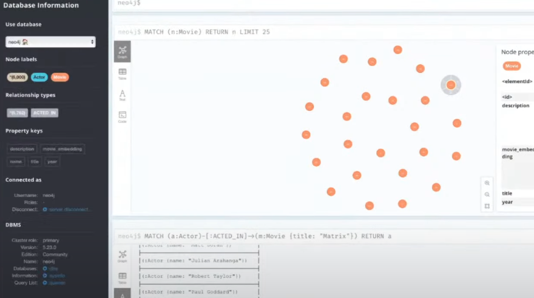

# AI Knowledge Graph System

This project integrates **Artificial Intelligence** with a **graph database**, providing a robust architecture for knowledge analysis, association, and querying.

---


## Technologies Used

* **Python + FastAPI + Uvicorn** → Building scalable REST APIs.  
* **Docker** → Containerization for portability and easy deployment.  
* **Neo4j** → Graph database for representing and associating knowledge.  
* **OpenAI API** → Access to state-of-the-art language models.  
* **LangChain** → Connecting LLMs to multiple data sources.  
* **LangGraph** → Managing execution flow between agents.  
* **ReACT** → Reasoning + Action → Framework for intelligent agents.  
* **Anaconda** → Creation and management of virtual environments.  

---

## RAG (Retrieval Augmented Generation)

To **prevent hallucinations** from language models, the **RAG** technique was implemented, which:

* Queries the database (Neo4j).  
* Retrieves relevant information.  
* Uses it as context to guide the LLM’s response.  

---

## Graph Database
---



Neo4j Running on the localhost

---


* Database: **Neo4j**  
* Query Language: **Cypher**  

> 🔎 You can manipulate and query the database using **Cypher**, Neo4j’s native query language.

Example usage with LangChain:

```python
from langchain.chains import GraphCypherQAChain

# Natural language to Cypher query conversion
chain = GraphCypherQAChain.from_llm(llm, graph=neo4j_graph)
response = chain.run("Which entities are connected to concept X?")
````

---

## Processing Flow

1. **Input**: User submits a natural language question.
2. **Transformation**: Text is converted into a vector for **semantic vector comparison**.
3. **Query**: Data is retrieved from Neo4j using **Cypher**.
4. **Reasoning**: Integration with **LangChain + LangGraph + ReACT** to structure the answer.
5. **Output**: Accurate response, based on real data and stored context.

---

## Virtual Environment

* The environment is created using **Anaconda**, ensuring dependency isolation and organization.
* It can be easily configured to run in **Docker** for deployment across any infrastructure.

---
