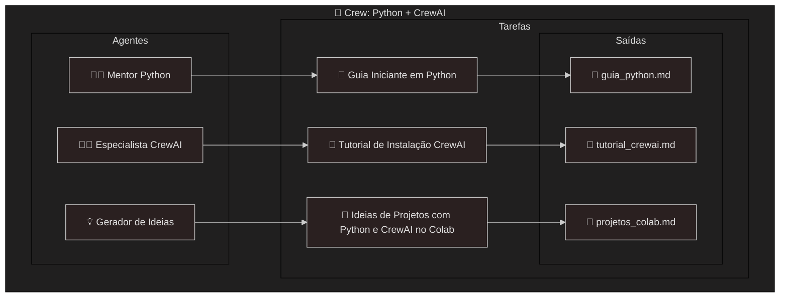

# Guided Practice with CrewAI in Google Colab

This repository contains a guided practice project developed in Google Colab.
All exercises and code examples can be run directly in your browser — no installation required.

# Project Overview

In this practice, we built a small Intelligent Agents project using Python and CrewAI.
The agents collaborate to generate tutorials, beginner guides, and project ideas, which are then exported as markdown files.
Click below to open the interactive notebook:

